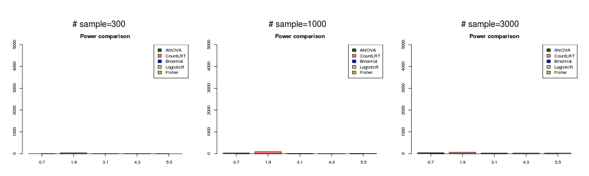
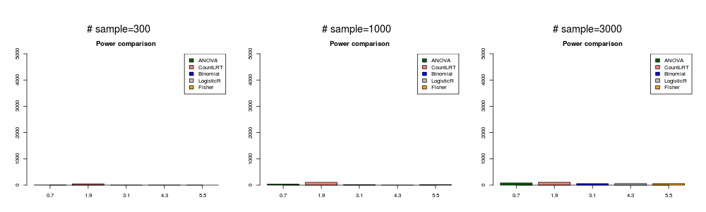
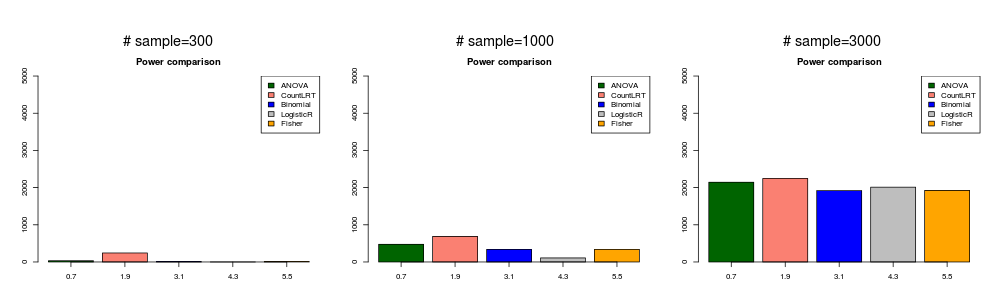
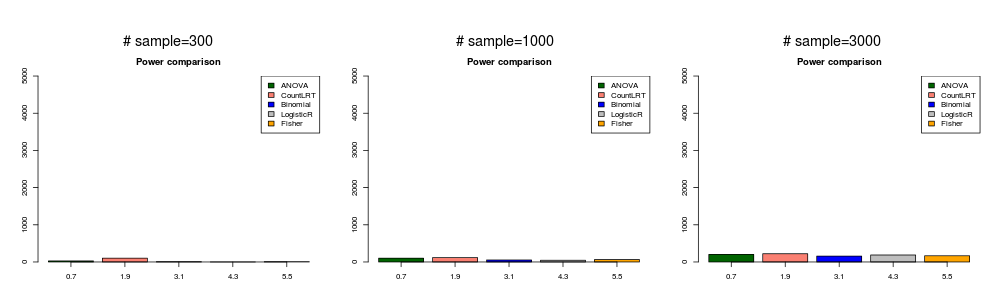
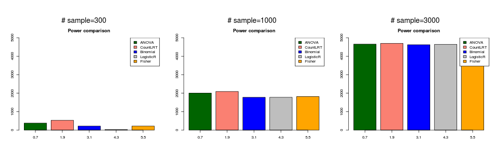

```{r setup, include=FALSE}
knitr::opts_chunk$set(echo = F)
```

## Methods
There are several approaches to identify genes associated with certain phenotypes. 

### 1. Multi-linear regression (ANOVA)
This was the approach used by domainXplorer ([Porta-Pardo and Godzik, 2016](http://cancerimmunolres.aacrjournals.org/content/early/2016/07/09/2326-6066.CIR-15-0233)). The software is available [here](https://github.com/eduardporta/domainXplorer).

Let $E_i$ be some form of immune score for tumor sample $i$, $T_i$ is the tumor type for sample $i$, $N_i$ is the total number of mutations in sample $i$ (or mutation rate)., $D_{jg}$ is the binary indicator of the mutation status for gene $g$ in sample $i$. For each $i$, we have the following model (for simplicity, omiting $i$)

 $$ E = \beta_0 + \beta_1 * T + \beta_2* N + \beta_3 *D_g. $$
In the next step, *p* value is obtained by ANOVA test. 

In [Ding et al 2018 cell](https://www.sciencedirect.com/science/article/pii/S0092867418303131?via%3Dihub), domainXplorer was used to identify driver events that correlate with the presence of different immune cell types. So $E$ is the cell type fraction. In [Rooney et al 2015 cell](https://www.sciencedirect.com/science/article/pii/S0092867414016390?via%3Dihub), $E$ is rank transformed CYT (cytolytic activity defined based on gene expression). 

### 2. Modeling of count data (CountLRT)
We propose a new approach to address this problem. Let $Y_{ij}$ be the number of mutations at position $j$, sample $i$, $Y_{ij} \in \{0,1\}$. $\mu_{ij}$ is background mutation rate at position $j$, sample $i$.

$$Y_{ij} \sim Bernoulli(\mu_{ij}\delta_{ij})$$
Here $\delta_{ij}$ is the deviation of observed mutation rate from the background mutation rate. It is dependent on the sample's immune score $E_i$ in the following way:

$$ log(\delta_{ij})=\beta_{ij}^0 + \beta_g*E_{i} $$

$\beta_g$ is gene $g$'s coefficient for $E_i$. For the null model, $\beta_g=0$. For the alternative model, we could get Maximum Likelihood Estimation for $\beta_g$ and get Bayes Factor for gene $g$. 

In our approach, we can take into account confounders by modeling $\mu_{ij}$ and $\beta_{ij}^0$. 

### 3. Binomial test
This method only works for binary $E_i$ data. In this approach, we aggregate all positions in a gene and count the number of mutations in $E_i=1$ ($N_1$) and $E_i=0$ ($N_2$) groups, we assess if $N_1$ deviates from $Binom(N_1+N_2, \frac{\#\{E_i=1\}} {\#\{E_i=1\} + \#\{E_i=0\}})$. 

### 4. logistic regression (gene level)
This method only works for binary $E_i$ data. 

$$log(\frac{p(E_i=1)}{1-p(E_i=1)})= \beta * D_i +\beta_0$$

### 5. Fisher's exact test
This method only works for binary $E_i$ data. In this approach, we aggregate all positions in a gene and count the number of mutations in $E_i=1$ ($N_1$) and $E_i=0$ ($N_2$) groups then use Fisher exact test a p value.

## Simulation

In this simulation, we assume no gene specific effect of background mutation rate, i.e. no $\lambda_g$ term for background mutation rate. Within the same gene, we assume all non-silent positions share the same selection mutation rate across positions, i.e does not distinguish functional positions from the rest non-silent positions.

**Generate data**  

* Generate $E_i$. For a given sample size $N$, we assign $N/2$ samples with $E=1$, the rest have $E=0$  

* Generate $Y_{ij}$. We randomly pick one gene, *ERBB3*. For $Y_{ij}$ in this gene, we simulate silent mutations based on realistic parameters estimated from UCS data using driverMAPS. We simulate nonsilent mutations with $\beta_{ij}^0=0$ (this implies that on average this gene is not selected) or $\beta_{ij}^0=1$ (this implies that on average this gene is positively selected). We simulate with $\beta_{g(j)}=\{0,0.2,0.8\}$. $\beta_{g(j)}=0$ indicates that this gene is not associated with the phenotype. Repeat this process 1000 times.

**Run analysis**  
We run five methods for each of the 5000 times and obtain p values (for method 2, p values are obtained by likelihood ratio tests). Compare number of rounds with p value <0.01 for these methods.

We assume all samples come from the same tumor type and the mutation rate in each sample is the same. For method 2, we didn't estimate mutation rate for each sample, but used the mutation rate from simulation. 

## Results
### gene is not associated with phenotype ( $\beta_g=0$ ).
In this simulation, the mutation data was generated with $\beta_{ij}^0=0$ and $\beta_g=0$. We treat all position $i$ with the same relative risk,i.e. didn't account for different functional impacts of among positions.

```{r null}
m<-file.copy("/Volumes/cancer_pheno/data_run/simulation_2019-01-08/power_betaf0=0_betagc=0.png","figures/power_betaf0=0_betagc=0.png")
#
```


### gene with low mutation rate and weakly associated with phenotype ( $\beta_{ij}^0=0$ and $\beta_g=0.2$ ).
In this simulation, the mutation data was generated with $\beta_{ij}^0=0$ and $\beta_g=0.2$.

```{r lowweak}
m<-file.copy("/Volumes/cancer_pheno/data_run/simulation_2019-01-08/power_betaf0=0_betagc=0.2.png","figures/power_betaf0=0_betagc=0.2.png")
```


### gene with low mutation rate and strongly associated with phenotype ( $\beta_{ij}^0=0$ and $\beta_g=0.8$ ).
In this simulation, the mutation data was generated with $\beta_{ij}^0=0$ and $\beta_g=0.8$. 

```{r lowstrong}
m<-file.copy("/Volumes/cancer_pheno/data_run/simulation_2019-01-08/power_betaf0=0_betagc=0.8.png","figures/power_betaf0=0_betagc=0.8.png")
```


### gene with high mutation rate and weakly associated with phenotype ( $\beta_{ij}^0=1$ and $\beta_g=0.2$ ).
In this simulation, the mutation data was generated with $\beta_{ij}^0=1$ and $\beta_g=0.2$. 

```{r highweak}
m<-file.copy("/Volumes/cancer_pheno/data_run/simulation_2019-01-08/power_betaf0=1_betagc=0.2.png","figures/power_betaf0=1_betagc=0.2.png")
```


### gene with high mutation rate and strongly associated with phenotype ( $\beta_{ij}^0=1$ and $\beta_g=0.8$ ).
In this simulation, the mutation data was generated with $\beta_{ij}^0=1$ and $\beta_g=0.8$. 
```{r highstrong}
m<-file.copy("/Volumes/cancer_pheno/data_run/simulation_2019-01-08/power_betaf0=1_betagc=0.8.png","figures/power_betaf0=1_betagc=0.8.png")
```

