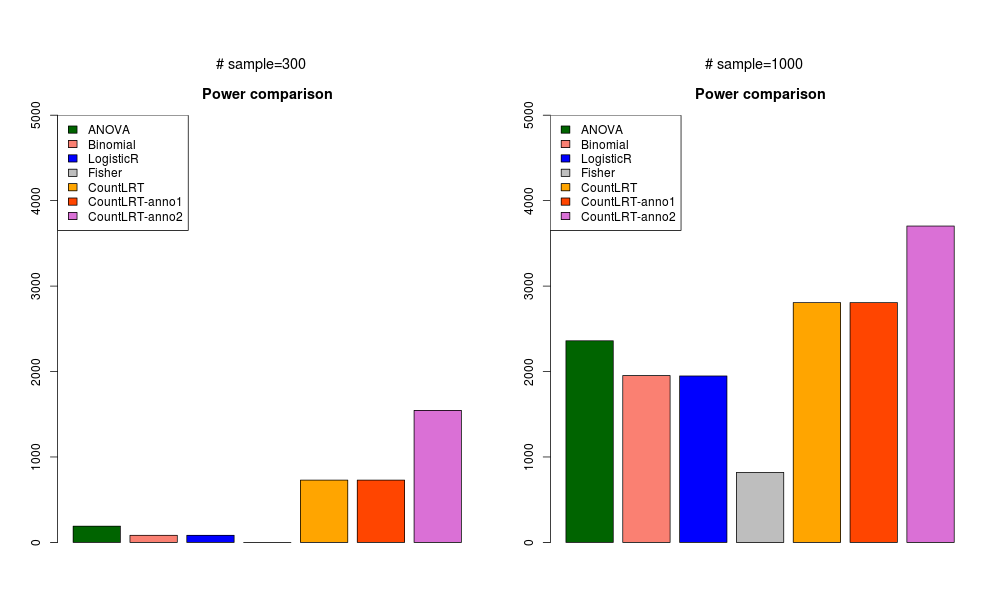

```{r setup, include=FALSE}
knitr::opts_chunk$set(echo = F)
```


## Methods

### Modeling of count data

  * **countLRT: only models mutation count data**

We propose a new approach to address this problem. Let $Y_{ij}$ be the number of mutations at position $j$, sample $i$, $Y_{ij} \in \{0,1\}$. $\mu_{ij}$ is background mutation rate at position $j$, sample $i$.

$$Y_{ij} \sim Bernoulli(\mu_{ij}\delta_{ij})$$
Here $\delta_{ij}$ is the deviation of observed mutation rate from the background mutation rate. It is dependent on the sample's immune score $E_i$ in the following way:

$$ log(\delta_{ij})=\beta_{ij}^0 + \betaE_{i} $$

$\beta$ is gene $g$'s coefficient for $E_i$. For the null model, $\beta=0$. For the alternative model, we could get Maximum Likelihood Estimation for $\beta$ and get Bayes Factor for gene $g$. 

In our approach, we can take into account confounders by modeling $\mu_{ij}$ and $\beta_{ij}^0$. 

  * **countLRT-anno1: use functional features, version 1**

Let $x_j$ be the vector of functional features at position $j$. Now $\delta_{ij}$ becomes: 

$$log(\delta_{ij})=\beta_{ij}^0 + \betaE_i + \beta^fx_j $$
$\beta^f$ is a vector of effect sizes for functional features. In this version, we use the same $\beta^f$ under null and alternative models. We use the esimates from driverMAPS for $\beta^f$ and treated it as known when estimating $\beta_g, \beta_{ij}^0$ for the alternative model and $\beta_{ij}^0$ the null model.

  * **countLRT-anno2: use functional features, version 2**

For binary $E_i$, we have 
$$log(\delta_{ij})=\beta_{ij}^0 + (\beta_g + \beta^fx_j)E_i $$
In this version, we plug in estimates from driverMAPS for $\beta^f$ when estimating $\beta_g, \beta_{ij}^0$ for the alternative model and $\beta_{ij}^0$ for the null model.

### Other method
For ANOVA, Binomial test, logistic regression (gene level), Fisher's exact test, they are the same as [previously described](simulation_power.html).

## Simulation

In this simulation, we assume no gene specific effect of background mutation rate, i.e. no $\lambda_g$ term for background mutation rate. Within the same gene, we used one functional feature LoF. the effect size for LoF feature is 1.51, which is the estimate from driverMAPS averaged across multiple tumor types.

**Generate data**  

* Generate $E_i$. For a given sample size $N$, we assign $N/2$ samples with $E=1$, the rest have $E=0$.

* Generate $Y_{ij}$. We randomly pick one gene, *ERBB3*. For $Y_{ij}$ in this gene, we simulate silent mutations based on realistic parameters estimated from UCS data using driverMAPS. We simulate nonsilent mutations with $\beta_g=0$ and $\beta^f = 0$ for situation that the gene is not under selection associated with phenotype $E_i$. For genes under selection, we simulate under the model of "countLRT-anno2". In implementation, we simulate with $\beta_g=\{0.5,1.2\}$ and $\beta^f = \hat{\beta^f}$ ($\hat{\beta^f}$ is the estimate from driverMAPS, 1.51 in this simulation.). Therefore, for samples with $E_i=1$, $log(\delta_{ij}) = \beta_{ij}^0 + \beta_g + \beta^fx_i$, for samples with $E_i=0$, $log(\delta_{ij}) = \beta_{ij}^0$  .Repeat this process 5000 times.

**Run analysis**  
We run five methods for each of the 5000 times and obtain p values. Compare number of rounds with p value <0.01 for these methods.

We assume all samples come from the same tumor type and the mutation rate in each sample is the same. For countLRT, anno1 and anno2 methods, we didn't estimate mutation rate for each sample, but used the mutation rate from simulation. 

## Results
### gene is not associated with phenotype ($\beta_g=0$ ).
In this simulation, the mutation data was generated with $\beta_{ij}^0=0$ and $\beta_g=0$. We treat all position $i$ with the same relative risk,i.e. didn't account for different functional impacts of among positions.

```{r null, eval= F}
m<-file.copy("/Volumes/cancer_pheno/data_run/simulation_2019-04-29/power_betaf0=0_betagc=0.png","figures/simulation_2019-04-29/power_betaf0=0_betagc=0.png")
#knitr::include_graphics("../figures/power_betaf0=0_betagc=0.png")
```


### gene with low mutation rate and weakly associated with phenotype ( $\beta_{ij}^0=0$ and $\beta_g=0.5$ ).
In this simulation, the mutation data was generated with $\beta_{ij}^0=0$ and $\beta_g=0.5$.

```{r lowweak, eval= F}
m<-file.copy("/Volumes/cancer_pheno/data_run/simulation_2019-04-29/power_betaf0=0_betagc=0.5.png","figures/simulation_2019-04-29/power_betaf0=0_betagc=0.5.png")
```


### gene with low mutation rate and strongly associated with phenotype ( $\beta_{ij}^0=0$ and $\beta_g=1.2$ ).
In this simulation, the mutation data was generated with $\beta_{ij}^0=0$ and $\beta_g=1.2$. 

```{r lowstrong, eval= F}
m<-file.copy("/Volumes/cancer_pheno/data_run/simulation_2019-04-29/power_betaf0=0_betagc=1.2.png","figures/simulation_2019-04-29/power_betaf0=0_betagc=1.2.png")
```


### gene with high mutation rate and weakly associated with phenotype ( $\beta_{ij}^0=1$ and $\beta_g=0.5$ ).
In this simulation, the mutation data was generated with $\beta_{ij}^0=1$ and $\beta_g=0.5$. 

```{r highweak, eval= F}
m<-file.copy("/Volumes/cancer_pheno/data_run/simulation_2019-04-29/power_betaf0=1_betagc=0.5.png","figures/simulation_2019-04-29/power_betaf0=1_betagc=0.5.png")
```


### gene with high mutation rate and strongly associated with phenotype ( $\beta_{ij}^0=1$ and $\beta_g=1.2$ ).
In this simulation, the mutation data was generated with $\beta_{ij}^0=1$ and $\beta_g=0.8$. 
```{r highstrong, eval= F}
m<-file.copy("/Volumes/cancer_pheno/data_run/simulation_2019-04-29/power_betaf0=1_betagc=1.2.png","figures/simulation_2019-04-29/power_betaf0=1_betagc=1.2.png")
```


