```{r setup, include=FALSE}
knitr::opts_chunk$set(echo = F)
```

## Methods

### Modeling of count data

  * **countLRT: only models mutation count data**

We propose a new approach to address this problem. Let $Y_{ij}$ be the number of mutations at position $j$, sample $i$, $Y_{ij} \in \{0,1\}$. $\mu_{ij}$ is background mutation rate at position $j$, sample $i$.

$$Y_{ij} \sim Bernoulli(\mu_{ij}\delta_{ij})$$
Here $\delta_{ij}$ is the deviation of observed mutation rate from the background mutation rate. It is dependent on the sample's immune score $E_i$ in the following way:

$$ log(\delta_{ij})=\beta^0 + \beta_{g(j)}E_{i} $$

$\beta_{g(j)}$ is gene $g$'s coefficient for $E_i$. For the null model, $\beta_{g(j)}=0$. For the alternative model, we could get Maximum Likelihood Estimation for $\beta_{g(j)}$ and get Bayes Factor for gene $g$. 

In our approach, we can take into account confounders by modeling $\mu_{ij}$ and $\beta^0$. 

  * **countLRT-anno: use functional features, allow different fractions of samples under selection in $E_i=1$ and $E_i=0$ groups**

Let $Z_i$ be the indicator of whether a gene of interest is under selection in sample $i$, then $Y_{ij}$ follows: 

$$Y_{ij} \sim Bernoulli(Z_i\gamma_j\mu_{ij} + (1-Z_i)\mu_{ij})$$ 

where $\gamma_j$ is the effect size depending on position $j$'s annotation when the gene is under selection. For $Z_i$, we have the following model:

$$ Z_i \sim Bernoulli(\pi_i) \qquad \log \frac{\pi_i}{1-\pi_i} = \alpha_0 + \alpha_1 E_i$$
To test if selection differs between two groups, for now, we used a simplified method: 
We introduce $\eta_1$ and $\eta_0$,  they can be treated approximately as the fraction of samples under selection for $E_i=1$ and $E_i=0$ groups, respectively. We have
	$$ y_{ij} | E_i = 1 \sim Bernoulli\left( \eta_1 (\gamma_i-1) \mu_{ij} + \mu_{ij} \right) \qquad y_{ij}| E_i=0 \sim Bernoulli\left( \eta_0 (\gamma_i-1) \mu_{ij} + \mu_{ij} \right) $$
We want to test $H_0: \eta_1 = \eta_0$ vs. $H_1: \eta_1 \neq \eta_0$. Under the null model( $H_0$), the likelihood function will only have one parameter, $\eta$, under $H_1$, we will have two parameters $\eta_0$, $\eta_1$. To incorporate multiple categories of mutations, we will use $\gamma_i$ inferred from driverMAPS, it will be fixed during parameter estimation. Ex. suppose we have two categories LoF and missense with effect size 5 and 2, respectively. In two groups, we may have $\eta_1 = 2$ and $\eta_0 = 0.5$, then the effect sizes in the groups become: (1) Group 1: 9 and 3; (2) Group 2: 3 and 1.5. 

* **countLRT-anno(bl): the baseline for countLRT-anno method**

Allow different fractions of samples under selection in $E_i=1$ and $E_i=0$ groups, but using one effect size for both missense and nonsense. 

* **countLRT-anno(lower): for countLRT-anno method, intentionally use smaller effect sizes for both functional categories**
In implementation, we use the real effect size - 0.5 for both categories to run countLRT-anno.

* **countLRT-anno(higher): intentionally use higher effect sizes for both functional categories**
In implementation, we use the real effect size + 0.7 for both categories to run countLRT-anno.

### Other method
For ANOVA, Binomial test, logistic regression (gene level), Fisher's exact test, they are the same as [previously described](simulation_power.html).

## Simulation

In this simulation, we assume no gene specific effect of background mutation rate, i.e. no $\lambda_g$ term for background mutation rate. Within the same gene, we used one functional feature LoF. the effect size for LoF feature is 1.51, which is the estimate from driverMAPS averaged across multiple tumor types.

**Generate data**  

* Generate $E_i$. For a given sample size $N$, we assign $N/2$ samples with $E=1$, the rest have $E=0$.

* Generate $Y_{ij}$. 
1. when the gene associates with $E_i$.

We randomly pick one gene, *ERBB3*. For $Y_{ij}$ in this gene, we simulate using background mutation rates estimated from UCS data using driverMAPS. For $E_i=1$ group, we simulate 80% samples in which the gene is under selection, For $E_i=0$ group, we simulate 20% samples in which the gene is under selection. For samples in which this gene is not under selection, we simulate missense and nonsense mutations with effect sizes (log scale) $(0, 0)$, for samples in which this gene is under selection, we simulate missense and nonsense mutations with effect sizes (log scale) $(0, 0 + 2.2)$, $(1.2, 1.2 + 2.2 )$ (the effect size for nonsense mutations is always $e^{2.2}$ fold of the missense effect size, we use this value, because on average, the entire dataset ($E_i=0$ and $E_i=1$)'s effect size for nonsense will be around $e^{1.5}$ of missense mutations and this is the estimated value by driverMAPS).

2. when the gene is not associated with $E_i$.

We simulate everything the same as above, except that for both $E_i=0$ and $E_i=1$ group, we simulate 50% samples in which the gene is under selection.

**Run analysis**  
We run five methods for each of the 500 times and obtain p values. Compare number of rounds with p value <0.01 for these methods.

We assume all samples come from the same tumor type and the mutation rate in each sample is the same. For countLRT and countLRT-anno methods, we didn't estimate mutation rate for each sample, but used the mutation rate from simulation. 

## Results: when gene is not associated with phenotype

For both $E_i=0$ and $E_i=1$ group, we simulate 50% samples in which the gene is under selection. 

### gene with low mutation rate and small effect size.
mutation rate in this gene is 1 x background mutation rate. The effect sizes in this gene (log scale, $E_i=1$ vs. $E_i=0$):  missense= 0, nonsense = 2.2. For countLRT-anno(bl) in sample size =300 and 1000 cases, we have some problem to get the correct parameter estimation results, it is marked by "x" in the figure. 

```{r lowweak-null}
m<-file.copy("/Volumes/cancer_pheno/data_run/simulation_2019-05-12/power_betaf0=0_betagc=0.png","figures/simulation_2019-05-12/power_betaf0=0_betagc=0.png")
```
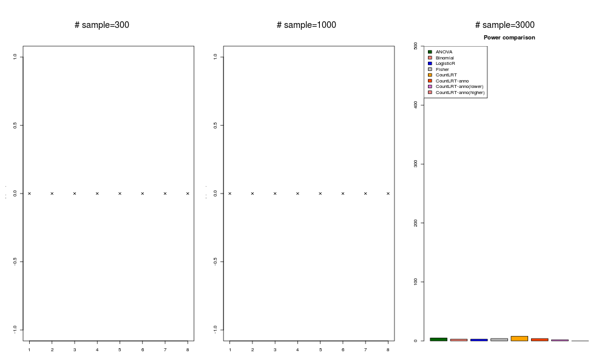

### gene with low mutation rate and large effect size.
mutation rate in this gene is 1 x background mutation rate. The effect sizes in this gene (log scale, $E_i=1$ vs. $E_i=0$)):  missense= 1.2, nonsense = 1.2 + 2.2. For countLRT-anno(bl) in sample size =300 case, we have some problem to get the correct parameter estimation results, it is marked by "x" in the figure. 

```{r lowstrong-null}
m<-file.copy("/Volumes/cancer_pheno/data_run/simulation_2019-05-12/power_betaf0=0_betagc=1.2.png","figures/simulation_2019-05-12/power_betaf0=0_betagc=1.2.png")
```
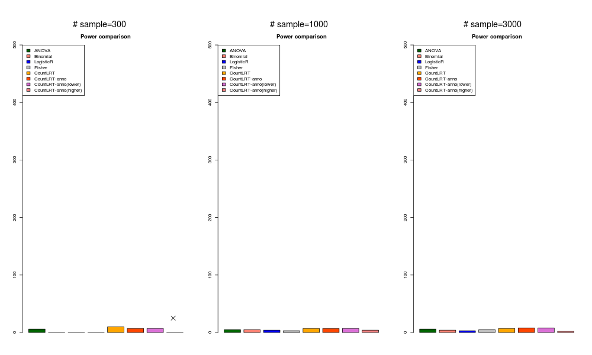

### gene with high mutation rate and small effect size.
mutation rate in this gene is 2.7 x background mutation rate. The effect sizes in this gene (log scale, $E_i=1$ vs. $E_i=0$)):  missense= 0, nonsense = 2.2. For countLRT-anno(bl) in sample size =300 case, we have some problem to get the correct parameter estimation results, it is marked by "x" in the figure. 

```{r highweak-null}
m<-file.copy("/Volumes/cancer_pheno/data_run/simulation_2019-05-12/power_betaf0=1_betagc=0.png","figures/simulation_2019-05-12/power_betaf0=1_betagc=0.png")
```
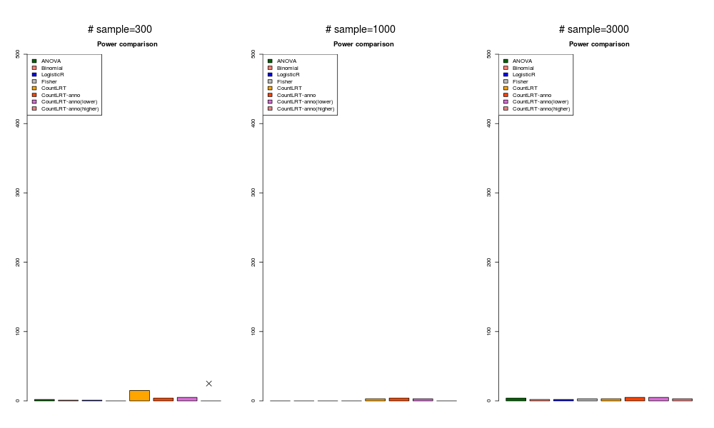

### gene with high mutation rate and large effect size.
mutation rate in this gene is 2.7 x background mutation rate. The effect sizes in this gene (log scale):  missense= 1.2, nonsense = 1.2 + 2.2. 

```{r highstrong-null}
m<-file.copy("/Volumes/cancer_pheno/data_run/simulation_2019-05-12/power_betaf0=1_betagc=1.2.png","figures/simulation_2019-05-12/power_betaf0=1_betagc=1.2.png")
```
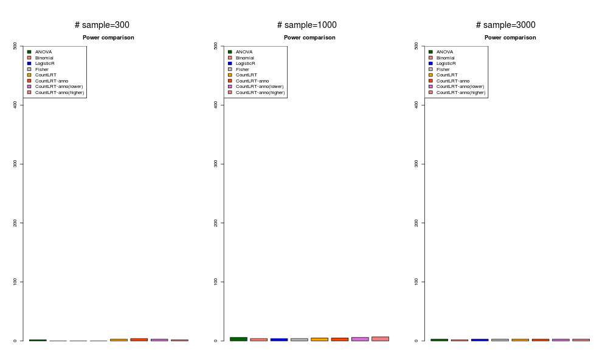

## Results: when gene associates with phenotype

For $E_i=0$, we simulate 20% samples in which the gene is under selection. For $E_i=1$, we simulate 80% samples in which the gene is under selection. 

### gene with low mutation rate and small effect size.
mutation rate in this gene is 1 x background mutation rate. The effect sizes in this gene (log scale, $E_i=1$ vs. $E_i=0$)):  missense= 0, nonsense = 2.2.

```{r lowweak}
m<-file.copy("/Volumes/cancer_pheno/data_run/simulation_2019-05-06/power_betaf0=0_betagc=0.png","figures/simulation_2019-05-06/power_betaf0=0_betagc=0.png")
```
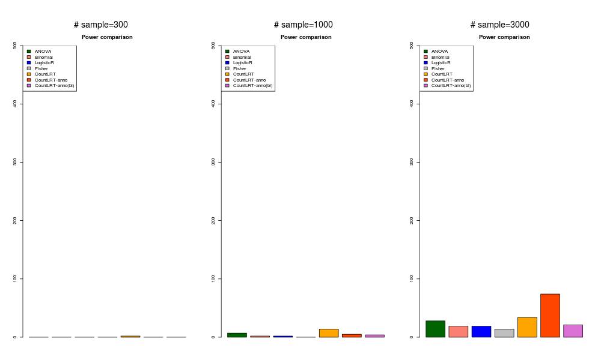

```{r lowweak-2}
m<-file.copy("/Volumes/cancer_pheno/data_run/simulation_2019-05-21/power_betaf0=0_betagc=0.png","figures/simulation_2019-05-21/power_betaf0=0_betagc=0.png")
```
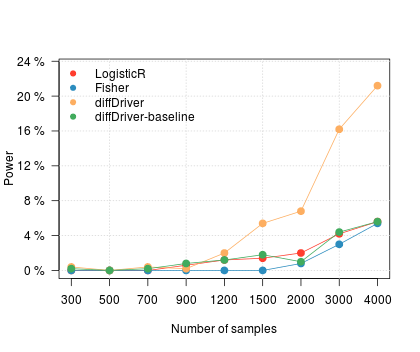

### gene with low mutation rate and large effect size.
mutation rate in this gene is 1 x background mutation rate. The effect sizes in this gene (log scale, $E_i=1$ vs. $E_i=0$)):  missense= 1.2, nonsense = 1.2 + 2.2.

```{r lowstrong}
m<-file.copy("/Volumes/cancer_pheno/data_run/simulation_2019-05-06/power_betaf0=0_betagc=1.2.png","figures/simulation_2019-05-06/power_betaf0=0_betagc=1.2.png")
```
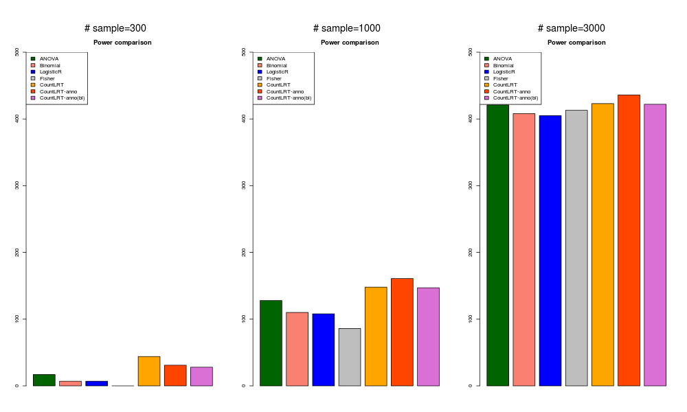
```{r lowstrong-2}
m<-file.copy("/Volumes/cancer_pheno/data_run/simulation_2019-05-21/power_betaf0=0_betagc=1.2.png","figures/simulation_2019-05-21/power_betaf0=0_betagc=1.2.png")
```
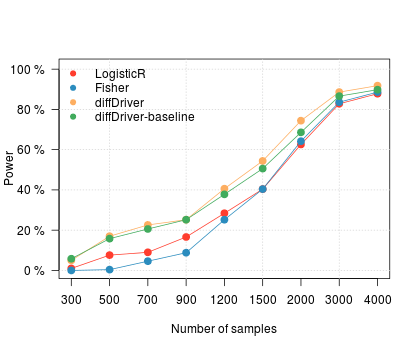


### gene with high mutation rate and small effect size.
mutation rate in this gene is 2.7 x background mutation rate. The effect sizes in this gene (log scale):  missense= 0, nonsense = 2.2.

```{r highweak}
m<-file.copy("/Volumes/cancer_pheno/data_run/simulation_2019-05-06/power_betaf0=1_betagc=0.png","figures/simulation_2019-05-06/power_betaf0=1_betagc=0.png")
```
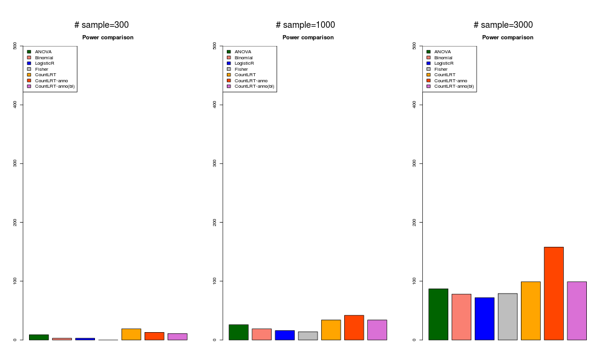
```{r highweak-2}
m<-file.copy("/Volumes/cancer_pheno/data_run/simulation_2019-05-21/power_betaf0=1_betagc=0.png","figures/simulation_2019-05-21/power_betaf0=1_betagc=0.png")
```
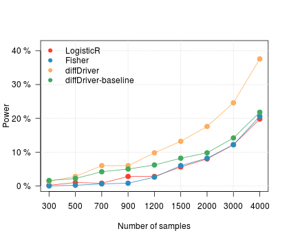

### gene with high mutation rate and large effect size.
mutation rate in this gene is 2.7 x background mutation rate. The effect sizes in this gene (log scale, $E_i=1$ vs. $E_i=0$)):  missense= 1.2, nonsense = 1.2 + 2.2.

```{r highstrong}
m<-file.copy("/Volumes/cancer_pheno/data_run/simulation_2019-05-06/power_betaf0=1_betagc=1.2.png","figures/simulation_2019-05-06/power_betaf0=1_betagc=1.2.png")
```
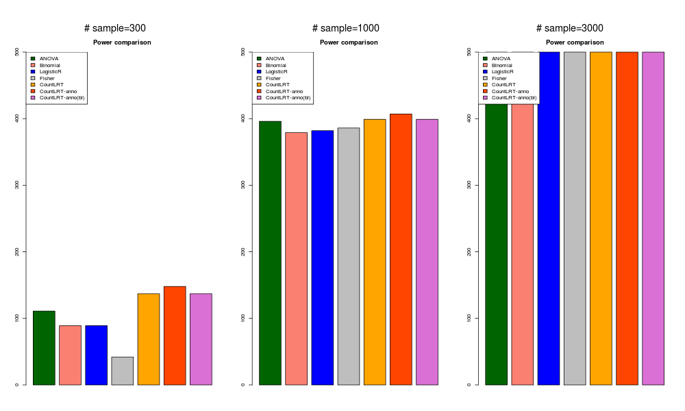
```{r highstrong-2}
m<-file.copy("/Volumes/cancer_pheno/data_run/simulation_2019-05-21/power_betaf0=1_betagc=1.2.png","figures/simulation_2019-05-21/power_betaf0=1_betagc=1.2.png")
```
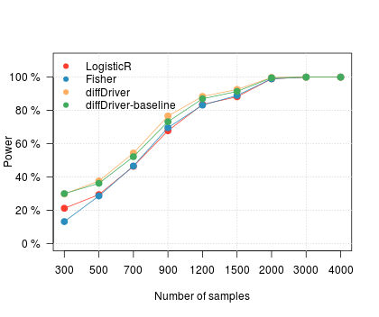


